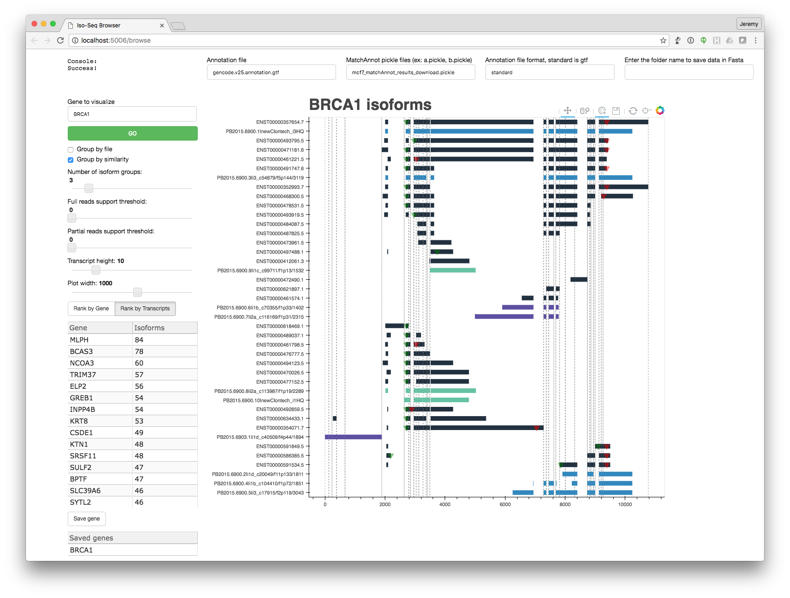

# Iso-Seq Browser



Iso-Seq Browser (ISB) is an interactive visual analytics tool for long-read RNA sequencing data produced by [Pacific Biosciences’ isoform sequencing (Iso-Seq) techniques](http://www.pacb.com/blog/intro-to-iso-seq-method-full-leng/). Key features of ISB are: 1) a web-based interface with zooming and exon highlighting for exploring reference gene transcripts and novel gene isoforms, 2) automated grouping of transcripts and isoforms by similarity, 3) many customization features for data exploration and creating publication ready figures, and 4) exporting selected isoforms into fasta files for further analysis. ISB builds on the excellent [MatchAnnot](https://github.com/TomSkelly/MatchAnnot) and [Isoview](https://github.com/JMF47/IsoView) tools, both of which provides analyses for Iso-Seq data.

ISB is written in Python and uses [Conda](http://conda.pydata.org/) for package management.
___

## Requirements

* Linux, Unix, or Mac OSX operating system
* [Miniconda, Python2 version](http://conda.pydata.org/miniconda.html) for a minimalist installation or [Anaconda, Python2 version](https://www.continuum.io/downloads) for a complete scientific Python installation. Both installations can be installed and used in a user's workspace, and neither requires special system permissions.

___
## Installation and running
1. Clone the repository:
   ```
   $ git clone https://github.com/goeckslab/isoseq-browser
   ```

   (or download and unzip form 'Clone or Download button'):


2. Run the Iso-Seq Browser:

   ```
   $ make run
   ```

	This will (i) create and populate a conda environement; (ii) download the required gene annotation and sample MCF7 dataset; and (iii) start ISB.

You can also issue three separate commands to set up and run ISB:

* Create the environment:

   ```
   $ make env
   ```

* Download a gene annotation and sample data:

   ```
   $ make
   $ make mcf7_matchAnnot_results_download.pickle
   ```

* Run Isoseq-browser:

   ```
    make run
   ```

___

## Using your own data
* Isoseq-browser requires two inputs: (a) a gene annotation in GTF format and (b) a MatchAnnot pickle file. Gene annotations are best found at [GENCODE](http://www.gencodegenes.org/). Run [MatchAnnot](https://github.com/TomSkelly/MatchAnnot) to create a pickle file with long reads matches to gene annotations. [Here are instructions for running MatchAnnot](https://github.com/TomSkelly/MatchAnnot/wiki/How-to-Run-matchAnnot).
* Run Isoseq-browser:

   ```
    make run ANNOTATION_GTF=my_annotation.gtf MATCHES_INPUT=my_matchannot_results.pickle
   ```

* Enter the gene to start visualize
* Use the other widgets for more options:

# Tips
* Visualizing the first gene will take ~90 seconds because the annotation and pickle files need to be loaded into memory. Visualization additional genes will be instantaneous.
* Grouping isoforms into many (> 10) clusters can be quite slow.
